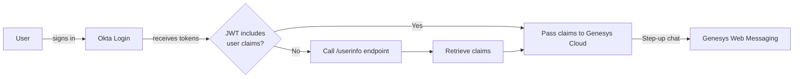

# Genesys Cloud Authenticated Web Messaging Integration

---

## 📋 Overview

This project integrates **Genesys Cloud Web Messaging** with **Okta Authentication** to provide a secure, modern, and seamless chat experience for users. It allows authenticated users to start chat sessions, while ensuring their full profile and identity information is properly passed to Genesys Cloud through JWT tokens.

---

## 🎯 Features

* Sign in with Okta (OAuth2.0, PKCE or Authorization Code)
* Secure step-up of Genesys web chat conversations
* Automatic retrieval of user email and full name
* Fallback to Okta Userinfo endpoint for complete user claims
* Language/region selection
* Responsive Bootstrap UI

---

## 🛠️ Design

---

## 🚩 Key Challenges & Solutions

### 1. **Missing Profile Claims in id\_token**

* **Challenge:**
  Okta's `id_token` sometimes did **not include** user attributes like `given_name` or `family_name` even with the `profile` scope requested. This led to anonymous or incomplete user info in chat.
* **Solution:**
  Detected missing claims after sign-in. If any profile attributes were missing, made an authenticated call to the `/userinfo` endpoint using the `access_token` to reliably fetch the complete user profile. Parsed and mapped the result for use in the step-up conversation.

### 2. **Web Messaging Step-Up Requires Concatenated Name**

* **Challenge:**
  Genesys Cloud Web Messaging expects the full name to be built from `given_name` and `family_name`. If not present, fallback logic was needed.
* **Solution:**
  Added a check to prefer full name from JWT, else concatenated `given_name` and `family_name` from either the token or the userinfo response.

### 3. **Okta Custom Claims and Namespaces**

* **Challenge:**
  Some environments required claims to be namespaced, or custom claims logic for mapping attributes.
* **Solution:**
  Added code and documentation on how to use Auth0/Okta rules (post-login scripts) to map standard or custom attributes for use in Genesys, with or without namespaces.

### 4. **Browser Token Exchange / State Handling**

* **Challenge:**
  Token parsing and exchange needed to be robust, especially with redirect flows.
* **Solution:**
  Improved state management and error handling, always updating the URL and restoring UI state as needed.

---

## 🚀 Usage

1. **Configure Okta Application:**

   * Ensure `openid`, `email`, `profile` scopes are enabled.
   * If needed, add custom claims for missing attributes.

2. **Deploy/Run the Application:**

   * Set your deployment ID and environment.
   * Sign in with Okta.
   * Start a Genesys Cloud web messaging session with authenticated context.

3. **Troubleshooting:**

   * If user names are not displaying in chat, confirm that the `/userinfo` endpoint returns the required claims.

---

## 📦 Tech Stack

* HTML / JavaScript (Vanilla, Bootstrap)
* Genesys Cloud Messenger SDK
* Okta Auth JS

---

## 🎨 UI

> *Simple, responsive, and modern chat authentication experience*

---

## 🤝 Contributions

Feel free to fork, open PRs, or raise issues!

---

## ✍️ Author

Takuya Sangil
Senior Engineer, Genesys Cloud API/Integrations

---

\:rocket: *Happy Messaging!*
